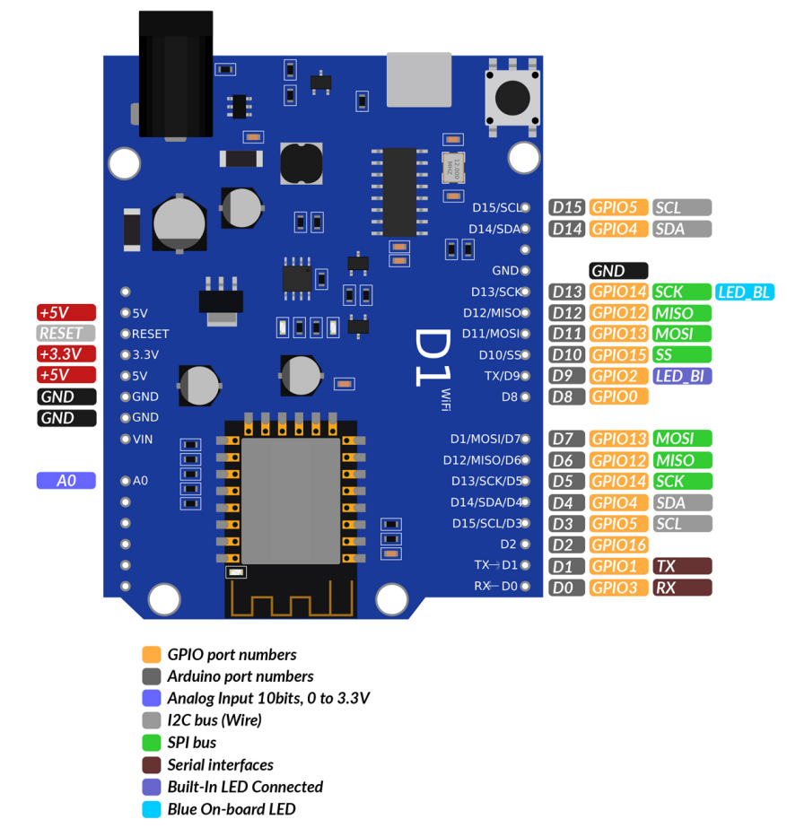

# Arduino workshop

## Obsah

- [00 Predtým než začneme](lessons/00/00.md)
- [01 Náš prvý program](lessons/01/01.md)
- [02 Použitie serial monitora](lessons/02/02.md)
- [03 Zapojenie displeja](lessons/03/03.md)
- [04 Zapojenie modulu na meranie teploty](lessons/04/04.md)
- [05 Pripojenie hodinového modulu RTC](lessons/05/05.md)
- [06 Pripojenie k wifi](lessons/06/06.md)

## Porty a zapojenie modulu D1

