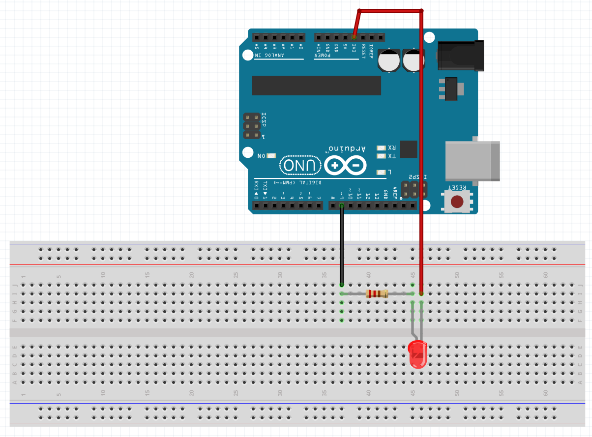

# 01 Náš prvý program

<br>
Tento program rozbliká LEDku na našom Arduine

```C
#include <Arduino.h>

void setup() {
    pinMode(LED_BUILTIN, OUTPUT);
}

void loop() {
    digitalWrite(LED_BUILTIN, LOW);
    delay(1000);

    digitalWrite(LED_BUILTIN, HIGH);
    delay(1000);
 }
```
<br><br><br>
#### Zapojme si extra LEDku na dosku podľa nasledovnej schémy
<br><br>

