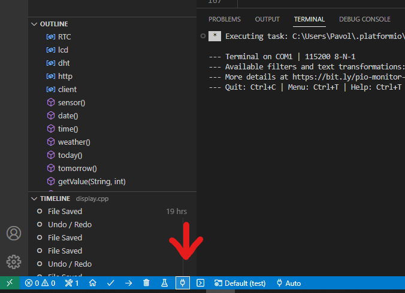

# 02 Využitie serial monitora

<br>
Pre využitie serial monitora pridáme do `setup()` funkcie nasledovný riadok:
<br/><br/>

```C
Serial.begin(115200);
```
<br><br>
Následne môžeme posielať akékoľvek textové dáta medzi našim Arduinom a počítačom pomocou nasledovných príkazov.
<br><br>
```C
Serial.print("Ahoj, svet!");

Serial.println("Ahoj, svet!");
```
<br><br>

#### Serial monitor nájdeme vo VS Code tu:
<br>


